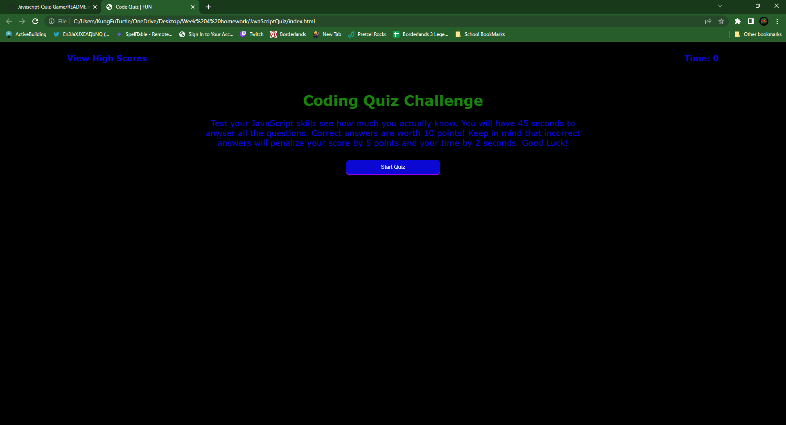
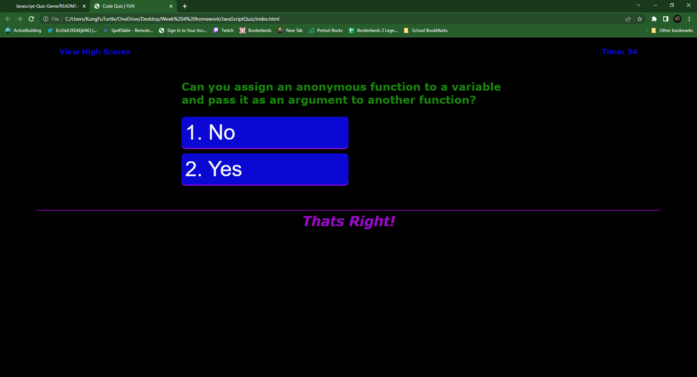
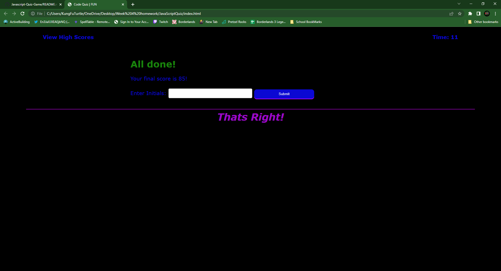
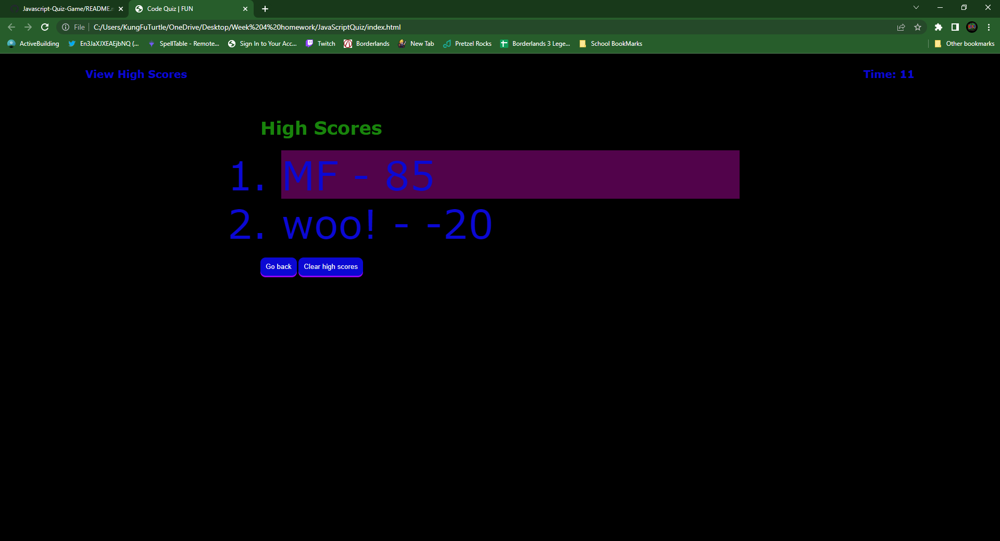

# JavaScriptQuiz
javascript Quiz Game with Local Storage of Scores

## Description
This in a simple quiz on javascript facts using multipule javascript functions to handle all the logic for the questions, timer and high score storage

## Screen Shots

